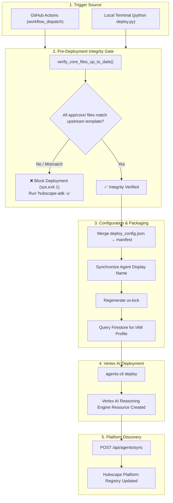

# Chapter 13: GEAP Agent Deployment Guide

This chapter provides a comprehensive guide to packaging and deploying custom Hubscape agents to Google Cloud as **Vertex AI Reasoning Engines** under the **Gemini Enterprise Agent Platform (GEAP)**.

---

## 1. Overview & Architecture

Hubscape agents run in containerized, sandboxed Google Cloud environments powered by Google Agent Development Kit (ADK) and Vertex AI Reasoning Engines (A2A Agent Runtime).

Deployment can be performed through two distinct pathways:
1. **GitHub Actions CI/CD (Recommended & Primary):** Automated deployment triggered through the repository's GitHub Actions interface using keyless OIDC authentication.
2. **Local CLI (`deploy.py`):** Direct deployment from a developer terminal authenticated via Google Cloud Application Default Credentials (ADC).



---

## 2. Pre-Deployment Platform Files Freshness Check

To prevent outdated, tampered, or incompatible platform infrastructure code from being deployed into production, `deploy.py` enforces a **mandatory pre-deployment integrity check** as its very first operation.

### Protected Platform Directories:
The integrity check monitors all platform-owned infrastructure code:
* **[`app/core/`](../../app/core):** Core platform adapters and runtime servers (`hubscape_adk.py`, `agent_runtime_app.py`, `geap_agent_wrapper.py`, `constants/`, `system_tools/`).
* **[`app/app_utils/`](../../app/app_utils):** Platform helper utilities (`vertex_gemini.py`, `a2a.py`, `services.py`, `reasoning_engine_adapter.py`, `telemetry.py`, `.requirements.txt`).

### How the Integrity Gate Works:
1. **Upstream Clone:** The script shallow-clones (`--depth 1`) the canonical [`hubscape-agent-template`](https://github.com/Zco-AI-Labs/hubscape-agent-template) repository into a secure temporary directory.
2. **Hash Comparison:** It recursively computes the SHA-256 cryptographic hashes of all files under `app/core/` and `app/app_utils/` in both the local repository and the upstream template.
3. **Drift Detection:** It flags:
   * **Modified files:** Any file whose hash differs from the canonical template.
   * **Missing files:** Any platform file present in the template but missing locally.
   * **Extra files:** Unauthorized files added inside platform directories.

### Blocking Behavior & Error Message:
If any divergence is detected, the deployment immediately halts with exit code `1` and outputs:

```text
================================================================================
❌ DEPLOYMENT BLOCKED: Project platform files are out of date or have been modified!
================================================================================
The following files under 'app/core/' and 'app/app_utils/' differ from canonical template:

Modified / Outdated files:
  • app/core/hubscape_adk.py
  • app/app_utils/vertex_gemini.py

👉 Please run 'hubscape-adk -u' to upgrade your project files before deploying.
================================================================================
```

### How Developers Resolve This Block:
1. On your local machine, execute the upgrade command:
   ```bash
   hubscape-adk -u
   ```
2. Inspect and verify the updated files in `app/core/` and `app/app_utils/`.
3. Commit and push the updated platform files to your agent repository:
   ```bash
   git commit -am "Upgrade platform files via hubscape-adk"
   git push origin main
   ```
4. Re-run your deployment workflow.

> [!TIP]
> **Emergency Bypass (`HUBSCAPE_SKIP_CORE_CHECK`):**
> In air-gapped environments, offline development, or critical production hotfix situations where GitHub access is temporarily unavailable, developers can bypass this check by setting:
> ```bash
> export HUBSCAPE_SKIP_CORE_CHECK=1
> ```

---

## 3. Deployment Method A: GitHub Actions Workflow (Primary)

The standard and recommended method for deploying agents is via GitHub Actions.

### Step-by-Step Developer Workflow:
1. Navigate to your agent repository on GitHub.
2. Click on the **Actions** tab.
3. Under **All workflows**, select **Deploy Agent to GEAP Registry**.
4. Click **Run workflow** (branch: `main`) and press the green button.

### How GitHub Actions Authentication Works:
* **Keyless Google Cloud Auth (OIDC):** The workflow uses Workload Identity Federation via `google-github-actions/auth@v2` using secrets configured at the organization or repository level (`GCP_WORKLOAD_IDENTITY_PROVIDER` and `GCP_SERVICE_ACCOUNT`). No long-lived service account keys are stored in GitHub.
* **Template Verification Auth (`ORG_GITHUB_TOKEN`):** To allow the GitHub Actions runner to inspect the private `hubscape-agent-template` repository during the core freshness check, the workflow passes:
  ```yaml
  GH_TOKEN: ${{ secrets.ORG_GITHUB_TOKEN || secrets.GH_TOKEN || github.token }}
  ```
  This secret is configured once at the `Zco-AI-Labs` GitHub Organization level and is automatically inherited by all agent repositories. Developers do not need to configure any personal access tokens.

---

## 4. Deployment Method B: Local Terminal (`deploy.py`)

Developers can deploy directly from their terminal using `deploy.py`.

### Prerequisites:
1. **Google Cloud SDK:** Ensure `gcloud` is installed and authenticated:
   ```bash
   gcloud auth login
   gcloud auth application-default login
   ```
2. **Dependencies:** Install the project dependencies and CLI tools:
   ```bash
   uv sync
   uv tool install google-agents-cli
   ```
3. **Git Access:** Ensure your local Git environment has read access to `https://github.com/Zco-AI-Labs/hubscape-agent-template` (via SSH keys or GitHub CLI `gh auth`).

### Running Deployment:
From the root of your agent repository, run:
```bash
python deploy.py
```

### What `deploy.py` Executes:
1. **Core Freshness Verification:** Verifies `app/core/` against `hubscape-agent-template`.
2. **Manifest Merging:** Merges developer customizations from `deploy_config.json` into `agents-cli-manifest.yaml`.
3. **Name Synchronization:** Extracts the agent's name from `app/SKILL.md` (or `app/agent.py`) and syncs it across `agents-cli-manifest.yaml`, `pyproject.toml`, and Terraform variables.
4. **Dependency Validation:** Runs `uv lock` to ensure `uv.lock` is fully updated.
5. **IAM Service Account Resolution:** Queries Firestore (`agents` collection) for the agent's registered `iam_profile` (defaulting to `sa-standard-agent@{PROJECT_ID}.iam.gserviceaccount.com`).
6. **Execution via `agents-cli`:** Runs `agents-cli deploy` to package and build the Vertex AI Reasoning Engine.
7. **Platform Registry Sync:** Sends an authenticated POST request to `/api/agents/sync` on the Hubscape platform backend to auto-register the newly deployed agent.

---

## 5. Developer Configuration Profiles (`deploy_config.json`)

To prevent developer-specific deployment settings from being erased when upgrading the project via `hubscape-adk -u`, all custom parameters are defined in `deploy_config.json` at the root of the project.

During deployment, `deploy.py` automatically merges `create_params` from `deploy_config.json` into `agents-cli-manifest.yaml`.

### Standard Agent Configuration:
```json
{
  "agents-cli-manifest": {
    "create_params": {
      "deployment_target": "agent_runtime",
      "is_a2a": true,
      "session_type": "in_memory",
      "cicd_runner": "skip",
      "include_data_ingestion": false,
      "datastore": "none",
      "agent_guidance_filename": "GEMINI.md"
    }
  }
}
```

### Knowledge Agent Configuration (RAG Corpus Datastore):
If your agent connects to a Google Vertex AI RAG Corpus for grounded document retrieval:
```json
{
  "agents-cli-manifest": {
    "create_params": {
      "deployment_target": "agent_runtime",
      "is_a2a": true,
      "session_type": "in_memory",
      "cicd_runner": "skip",
      "include_data_ingestion": true,
      "datastore": "projects/hubscape-geap/locations/us-central1/ragCorpora/8331289874728484864",
      "agent_guidance_filename": "GEMINI.md"
    }
  }
}
```

---

## 6. Post-Deployment Platform Sync & Verification

Once `agents-cli deploy` finishes deploying the reasoning engine to Google Cloud:

1. **Automatic Discovery Webhook:** `deploy.py` triggers an HTTP POST to:
   * `https://hubscape-backend-w3xi4ozhca-uc.a.run.app/api/agents/sync`
   * Authenticated using `X-Hubscape-Secret` (resolved from Secret Manager `HUBSCAPE_KMS_MASTER_KEY`).
2. **Firestore Registration:** The Hubscape platform backend queries GCP Vertex AI, discovers the new Reasoning Engine instance, creates a shadow document in the Firestore `agents` collection, and extracts the agent's capabilities from its `SKILL.md` description.
3. **Admin Verification:**
   * Log into the **Hubscape Platform Admin Console**.
   * Navigate to **Agent Registry**.
   * Verify that your agent appears with a status of **Active** and that its assigned tools and description match your `SKILL.md` specification.

---

[Previous Chapter: Evaluation & Diagnostics](CHAPTER_12_EVALUATION_AND_DIAGNOSTICS.md) | [Back to Manual Overview](CHAPTER_1_OVERVIEW.md)
